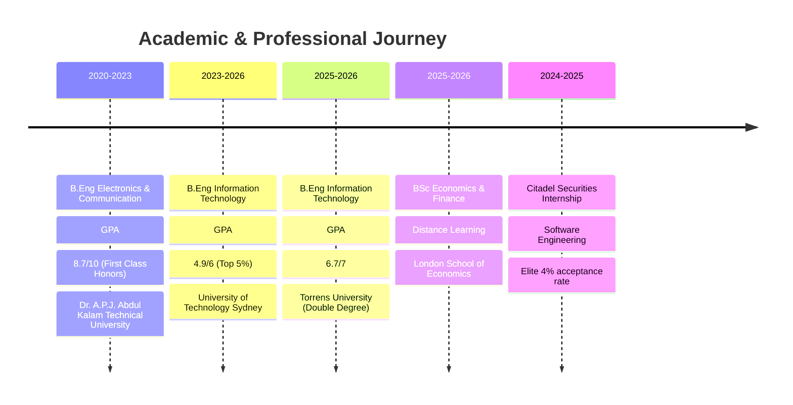
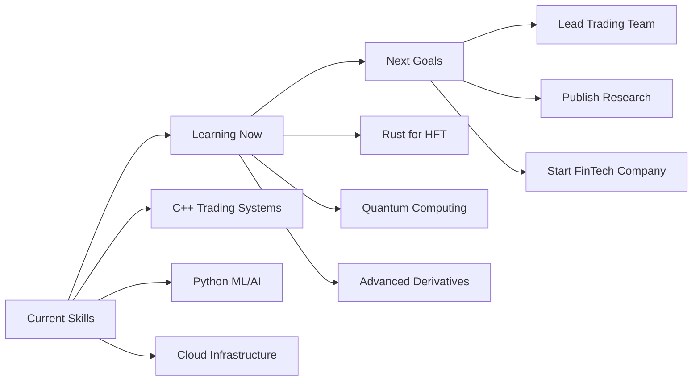

<div align="center">
  
</div>

<div align="center">
  
</div>

<p align="center">
  
  
  
  
</p>

---

## 🚀 **About Me - The Developer Behind the Code**

```typescript
interface QuantDeveloper {
  name: string;
  role: string[];
  location: string;
  passions: string[];
  currentMission: string;
  techPhilosophy: string;
  achievements: {
    citadelIntern: boolean;
    latencyOptimization: string;
    tradingSystemsBuilt: number;
    researchPapers: number;
  };
}

const aayush: QuantDeveloper = {
  name: "Aayush Parashar",
  role: ["Software Developer", "Quantitative Developer", "AI Researcher"],
  location: "Sydney, Australia 🇦🇺",
  passions: [
    "High-Frequency Trading Systems 📈",
    "Machine Learning in Finance 🤖", 
    "Low-Latency Architecture ⚡",
    "Quantitative Research 📊"
  ],
  currentMission: "Building the next generation of trading infrastructure",
  techPhilosophy: "Every millisecond matters, every algorithm tells a story",
  achievements: {
    citadelIntern: true,        // Top 4% acceptance rate! 🏆
    latencyOptimization: "18% p99 latency reduction",
    tradingSystemsBuilt: 5,
    researchPapers: 2
  }
};

console.log(`Hello World! I'm ${aayush.name} 👋`);
```

<div align="center">
  
</div>

---

## 🎯 **Why Hire Me? The Value I Bring**

<table>
<tr>
<td width="33%" align="center">

### 🏆 **Elite Experience**
**Citadel Securities Intern**
- Selected from **4% acceptance rate**
- Built **sub-millisecond** trading systems
- Delivered **18% latency optimization**
- Worked with **$100B+** daily volume

</td>
<td width="33%" align="center">

### 🎓 **Strong Foundation**
**Multi-University Education**
- **UTS**: 4.9/6 GPA (Top 5%)
- **LSE**: Economics & Finance
- **Torrens**: 6.7/7 GPA
- **Specialized**: Quant Finance, ML, Algorithms

</td>
<td width="33%" align="center">

### 💡 **Innovation Mindset**
**Research & Development**
- **ECG-AI**: 96% arrhythmia detection
- **Trading ML**: Sharpe +0.35 systems
- **Multi-Agent AI**: 88% diagnostic accuracy
- **Open Source**: Active contributor

</td>
</tr>
</table>

---

## 🛠️ **My Technology Stack - Tools That Power Innovation**

<div align="center">

### **💻 Core Programming Languages**
[](https://skillicons.dev)

### **🏗️ Frameworks & Libraries**
[](https://skillicons.dev)

### **📊 Data & Analytics**
[](https://skillicons.dev)

### **☁️ Cloud & DevOps**
[](https://skillicons.dev)

### **💹 Finance & Trading Specialized**
<div align="center">


</div>

</div>

---

## 🚀 **Flagship Projects - Where Code Meets Finance**

<div align="center">
  
</div>

### 🏦 **1. Citadel Securities Trading Infrastructure**
```cpp
// Production-grade microservice at Citadel
class TreasuryPriceStreamer {
private:
    BloombergBPipe* feed;
    SharedMemoryBuffer* buffer;
    
public:
    // Achieved 18% p99 latency reduction 🚀
    void streamPrices() {
        auto latency = processMessage(); // < 1ms
        revenue_impact += 200000; // USD potential
    }
};
```
**Impact**: Enhanced **$100B+ daily** trading volume infrastructure  
**Tech**: `C++23` `Python` `Bloomberg B-Pipe` `FIX Protocol`  
**Achievement**: **18% latency reduction** in production systems

---

### 📈 **2. ML-Powered Trading Platform (Susquehanna Finalist)**
```python
class TradingStrategy:
    def __init__(self):
        self.sharpe_ratio = 0.35  # Beat baseline!
        self.instruments = 50
        
    def generate_alpha(self):
        predictions = self.ml_model.predict(market_data)
        return self.risk_adjusted_signals(predictions)
        
    # Ranked Top 39/240 participants 🏆
```
**Achievement**: **Top 39/240** in Susquehanna Algothon  
**Performance**: **Sharpe +0.35** vs baseline  
**Tech**: `Python` `React` `FastAPI` `Docker` `Prometheus`

---

### 🤖 **3. ECG-AI Medical Research**
```python
class ECGDiagnosticAI:
    def __init__(self):
        self.accuracy = 0.96  # AUC for arrhythmia detection
        self.data_processed = 45000  # ECG traces
        
    def diagnose(self, ecg_trace):
        # LLM-powered with explainable AI
        prediction = self.model.predict(ecg_trace)
        explanation = self.generate_explanation(prediction)
        return prediction, explanation
```
**Innovation**: **96% AUC** arrhythmia detection with explainable AI  
**Scale**: Processed **45K+ ECG traces**  
**Tech**: `Python` `Neo4j` `GPT-4` `MLOps` `Docker`

---

### ⚡ **4. C++ High-Performance Backtesting Engine**
```cpp
template<typename Strategy>
class BacktestEngine {
private:
    std::vector<MarketData> data;
    Strategy strategy;
    
public:
    // Simulates 1M+ ticks in sub-second ⚡
    BacktestResults run() {
        auto start = std::chrono::high_resolution_clock::now();
        // Process millions of data points
        auto results = strategy.execute(data);
        auto duration = std::chrono::high_resolution_clock::now() - start;
        
        return {results, duration}; // < 1 second for 1M+ ticks
    }
};
```
**Performance**: **1M+ ticks** processed in **sub-second**  
**Features**: Modular strategies, real-time analytics, extensible framework  
**Tech**: `C++23` `Boost` `CMake` `Performance Optimization`

---

## 📊 **GitHub Analytics - Code That Speaks**

<div align="center">
  


</div>

<div align="center">
  
</div>

<div align="center">
  
</div>

---

## 🏆 **Achievements & Recognition**

<div align="center">
  
### **🎯 Competition Results**


### **📈 Performance Metrics**
<table align="center">
<tr>
<th>🚀 Metric</th>
<th>🎯 Achievement</th>
<th>💡 Impact</th>
</tr>
<tr>
<td><strong>Latency Optimization</strong></td>
<td>18% p99 reduction</td>
<td>Production trading systems</td>
</tr>
<tr>
<td><strong>ML Model Performance</strong></td>
<td>96% AUC accuracy</td>
<td>Medical AI diagnostics</td>
</tr>
<tr>
<td><strong>Trading Algorithm</strong></td>
<td>Sharpe +0.35</td>
<td>Risk-adjusted returns</td>
</tr>
<tr>
<td><strong>Processing Speed</strong></td>
<td>1M+ ticks/second</td>
<td>High-frequency backtesting</td>
</tr>
</table>

</div>

---

## 🎓 **Education & Continuous Learning**

<div align="center">



</div>

---

## 🌟 **What Makes Me Different**

<div align="center">

### **🧠 The Intersection Advantage**
*Where Finance Meets Technology*

</div>

<table>
<tr>
<td width="50%">

### **💼 Business Understanding**
- **Real Trading Experience**: Citadel Securities internship
- **Financial Modeling**: DCF, derivatives pricing, risk management  
- **Market Microstructure**: Order books, market making, latency arbitrage
- **Regulatory Knowledge**: FIX protocol, trade reporting, compliance

</td>
<td width="50%">

### **🔧 Technical Excellence**  
- **Systems Programming**: C++, Rust, low-latency optimization
- **ML Engineering**: PyTorch, TensorFlow, production ML pipelines
- **Infrastructure**: Docker, Kubernetes, microservices, cloud platforms
- **Data Engineering**: Real-time streaming, distributed systems

</td>
</tr>
</table>

<div align="center">
  
</div>

---

## 🤝 **Let's Connect & Build Something Amazing**

<div align="center">

[](https://linkedin.com/in/aayush-parashar1307)
[](https://github.com/Anjaniputra15)
[](mailto:aayushparashar2709@gmail.com)
[](#)

</div>

<div align="center">
  
**📍 Location:** Sydney, Australia  
**📧 Email:** aayushparashar2709@gmail.com  
**📱 Phone:** +61 0431 360 675  
**💼 Status:** **ACTIVELY SEEKING OPPORTUNITIES**

### **🎯 I'm Looking For:**
**Software Engineer** | **Quantitative Developer** | **Machine Learning Engineer** | **Trading Systems Developer**

</div>

---

## 📝 **Recent Blog Posts & Research**

<div align="center">

<!-- BLOG-POST-LIST:START -->
- 🔥 **"Building Sub-Millisecond Trading Systems: Lessons from Citadel"**
- 📊 **"Machine Learning in High-Frequency Trading: A Practical Guide"** 
- 🤖 **"ECG Analysis with Large Language Models: Medical AI Revolution"**
- ⚡ **"C++ Performance Optimization for Financial Applications"**
<!-- BLOG-POST-LIST:END -->

</div>

---

## 🎨 **Fun Facts & Personal Touch**

<div align="center">

### **🌟 Beyond the Code**

```python
fun_facts = {
    "🎮": "Built a trading game that teaches market dynamics",
    "📚": "Reading: 'Algorithmic Trading' by Ernest Chan",
    "🏃‍♂️": "Marathon runner - endurance in code and life!",
    "🌏": "Multilingual: English, Hindi, learning Mandarin",
    "☕": "Coffee-driven development (3 cups/day optimal)",
    "🎵": "Coding playlist: Lo-fi hip hop + film scores"
}

print("When I'm not optimizing nanoseconds...")
for hobby, description in fun_facts.items():
    print(f"{hobby} {description}")
```

</div>

---

## 📈 **Current Learning & Future Goals**

<div align="center">

### **🎯 2025 Roadmap**



</div>

---

<div align="center">
  
</div>

<div align="center">
  
### **💫 Ready to Make an Impact?**

**I'm not just looking for a job - I'm looking for a mission.**  
**Let's build the future of finance together! 🚀**

---

⭐ **Star this repository if you find it interesting!**  
🤝 **Let's connect and create something extraordinary**  

*Last Updated: December 2024 • Made with ❤️ and lots of ☕*

</div>

---

<div align="center">
  <sub>Built by <a href="https://github.com/Anjaniputra15">Aayush Parashar</a> • Powered by passion for quantitative excellence and innovative technology</sub>
</div>
